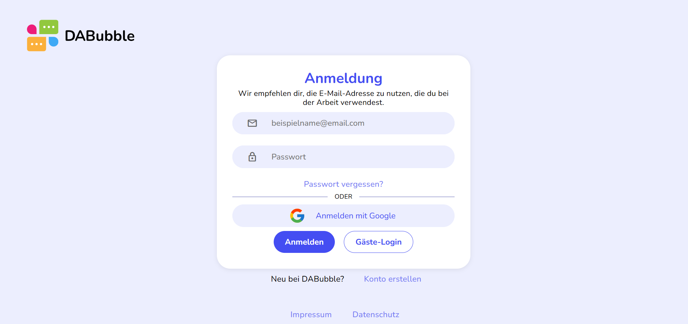
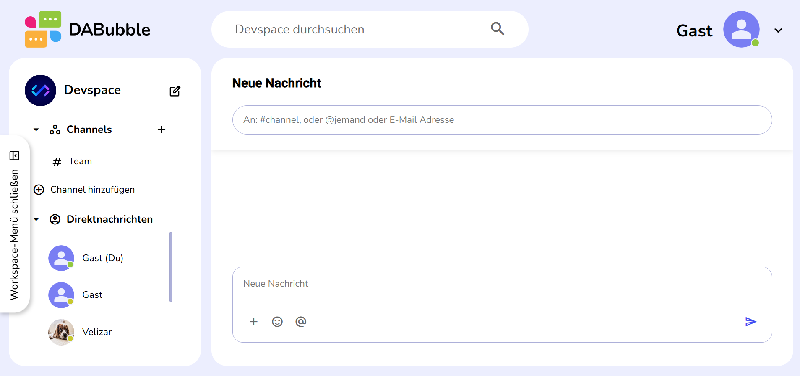
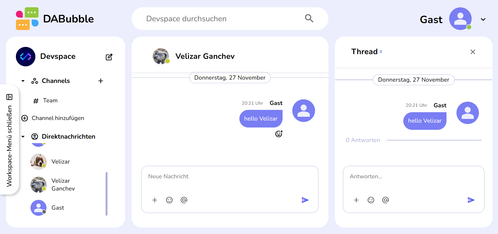

# DaBubble
A modern Slack-style team messenger built with Angular and Firebase.

## Overview
DaBubble is a channel-based communication app focused on team collaboration and real-time messaging. It is implemented as a modern Angular frontend that integrates with Firebase services for authentication and data storage. The project was developed as a training and portfolio application to practice production-style architecture, component-driven development, and cloud-backed features.

## Live Demo
A live version of DaBubble is available here:

- **App URL:** https://dabubble.velizar-ganchev.com  
- **Login page:** https://dabubble.velizar-ganchev.com/auth/logIn  

You can sign in with your own Firebase-backed account (if configured) or use the **guest login** flow.

## Key Features
The following features are supported or scaffolded based on the current implementation and dependencies:

- Channel-based messaging experience
- Real-time data backed by Firebase/Firestore (via AngularFire)
- Responsive UI optimized primarily for desktop and tablet
- Authentication with email/password and Google sign-in (using Firebase Auth)
- Guest login option for quick access
- Component-driven dialogs and views (Angular Material)
- Emoji picker support (via `@ctrl/ngx-emoji-mart`)
- Generated project documentation (Compodoc artifacts under `documentation/`)

> Note: Some advanced features (such as threads or direct messages) may be in progress. For the most up-to-date state, refer to the code in `src/app` and the Compodoc output in `documentation/`.

## Tech Stack
- **Framework:** Angular 17 (Angular CLI)
- **Language:** TypeScript
- **UI & Styling:** SCSS, HTML, Angular Material
- **Backend-as-a-Service:** Firebase / Firestore (via AngularFire)
- **State & Streams:** RxJS
- **Additional libraries:**
  - `@ctrl/ngx-emoji-mart` for emoji selection
  - `uuid` for unique ID generation
  - `tslib`, `zone.js` (Angular runtime dependencies)
  - Karma/Jasmine for unit testing

## Architecture & Project Structure
DaBubble follows a component-driven architecture with feature areas, shared UI elements, and dedicated services for Firebase integration. Angular routing controls navigation between authentication and main app views, while dialogs and overlays are implemented through Angular Material components.

Interactions with Firebase:
- AngularFire services (from `@angular/fire`) handle Firestore reads/writes and authentication.
- Configuration is driven by environment files and Angular CLI build configurations.

High-level project structure (major parts):

```text
src/
  app/
    ... (features, components, services, routing)
  assets/
  environments/
  index.html
  main.ts
  styles.scss
documentation/
  index.html
  modules.html
  components/
  interfaces/
  injectables/
angular.json
package.json
firebase.json
tsconfig*.json
```

### Folder Overview

| Folder / File           | Description                                                   |
|-------------------------|---------------------------------------------------------------|
| `src/app`              | Main Angular application (components, modules, routing)       |
| `src/app/services`     | Services for Firebase access and app logic                    |
| `src/app/components`   | Reusable UI components and dialogs                            |
| `src/environments`     | Environment configuration including Firebase settings         |
| `src/assets`           | Static assets such as images, icons, and fonts                |
| `documentation/`       | Compodoc-generated documentation (HTML)                       |
| `angular.json`         | Angular workspace and build configuration                     |
| `firebase.json`        | Firebase hosting/emulator configuration (currently minimal)   |
| `package.json`         | Dependencies and npm scripts                                  |

## Screenshots





The login screen demonstrates the clean, modern UI with options for email, Google sign-in, and guest login.

## Getting Started

### Prerequisites
- Node.js (LTS recommended, e.g., Node 18+)
- npm (bundled with Node)
- Angular CLI installed globally (optional but recommended):
  ```bash
  npm install -g @angular/cli
  ```
- A Firebase project with Firestore and Authentication enabled

Dependencies in `package.json` indicate Angular 17 across core packages and `@angular/fire` for Firebase integration.

### Installation
1. Clone the repository:
   ```bash
   git clone https://github.com/velizarganchev/DaBubble.git
   cd DaBubble
   ```

2. Install dependencies:
   ```bash
   npm install
   ```

### Firebase Configuration
Provide your Firebase configuration so AngularFire can initialize the app.

1. Create or update the environment file used by your setup, for example:
   - `src/environments/environment.ts` (for development)
   - and optionally `src/environments/environment.prod.ts` (for production)

2. Include your Firebase app configuration keys:
   ```ts
   export const environment = {
     production: false,
     firebase: {
       apiKey: '...',
       authDomain: '...',
       projectId: '...',
       storageBucket: '...',
       messagingSenderId: '...',
       appId: '...',
       measurementId: '...' // optional
     }
   };
   ```

3. Ensure that the AngularFire modules are initialized in your root module or bootstrap logic according to the current Angular best practices used in the project.

> Note: `firebase.json` exists but is currently minimal/empty. You can extend it with Firebase Hosting, emulators, or deploy configuration as needed.

### Run the Development Server

To start the app in development mode:

```bash
npm start
```

Then open your browser at:

- `http://localhost:4200/`

Angular will automatically reload the app on file changes.

### Production Build

To create an optimized production build:

```bash
npm run build
```

By default, the build output is emitted under `dist/da-bubble` (see `angular.json`). You can deploy this folder to any static hosting provider or integrate with Firebase Hosting.

### Tests

To run unit tests with Karma and Jasmine:

```bash
npm test
```

Additional linting or formatting scripts can be configured using tools like ESLint or Prettier and added to `package.json` as needed.

## NPM Scripts

Commonly used scripts defined in `package.json`:

- `ng` – Angular CLI runner
- `npm start` – Starts the dev server (`ng serve`)
- `npm run build` – Builds the app (`ng build`)
- `npm run watch` – Builds the app and watches for file changes (`ng build --watch --configuration development`)
- `npm test` – Runs unit tests (`ng test`)

## Development Guidelines

- **Architecture:** Component-driven, with clear separation of concerns between UI components and services.
- **Styling:** Global styles are defined in `styles.scss` and `fonts.scss`, with feature-specific styles scoped at component level.
- **Naming conventions:**
  - Components: `*.component.ts`
  - Services: `*.service.ts`
  - Interfaces/Models: Typically placed under `src/app/models` (or similar) and documented under `documentation/interfaces/`.
- **Firebase access:** Encapsulated in dedicated services to keep components lean and focused on presentation and interaction.

For in-depth, code-level documentation, open `documentation/index.html` in a browser and explore the modules, components, and injectables generated by Compodoc.

## Roadmap / Possible Improvements

Potential next steps to evolve DaBubble further:

- Full authentication UX (registration flows, password reset UI, profile management)
- Rich message composer with mentions, file attachments, and markdown support
- Message reactions (emoji) and improved emoji picker UX
- Presence indicators (online/away) and “user is typing” feedback
- Push notifications for mentions and channel activity
- Improved mobile layout and accessibility (ARIA attributes, keyboard navigation)
- Theming support (light/dark mode switching)

## Acknowledgements

DaBubble was created as part of a training program (**Developer Akademie**) and serves as a portfolio project demonstrating modern Angular and Firebase practices, as well as real-time communication UI patterns.

## License

License: not specified.

If you intend to open-source the project, consider adding a dedicated `LICENSE` file (for example, MIT, Apache 2.0, or another suitable license).

## Author / Contact

- **Author:** Velizar Ganchev  
- **Portfolio:** https://velizar-ganchev.com  
- **GitHub:** https://github.com/velizarganchev
